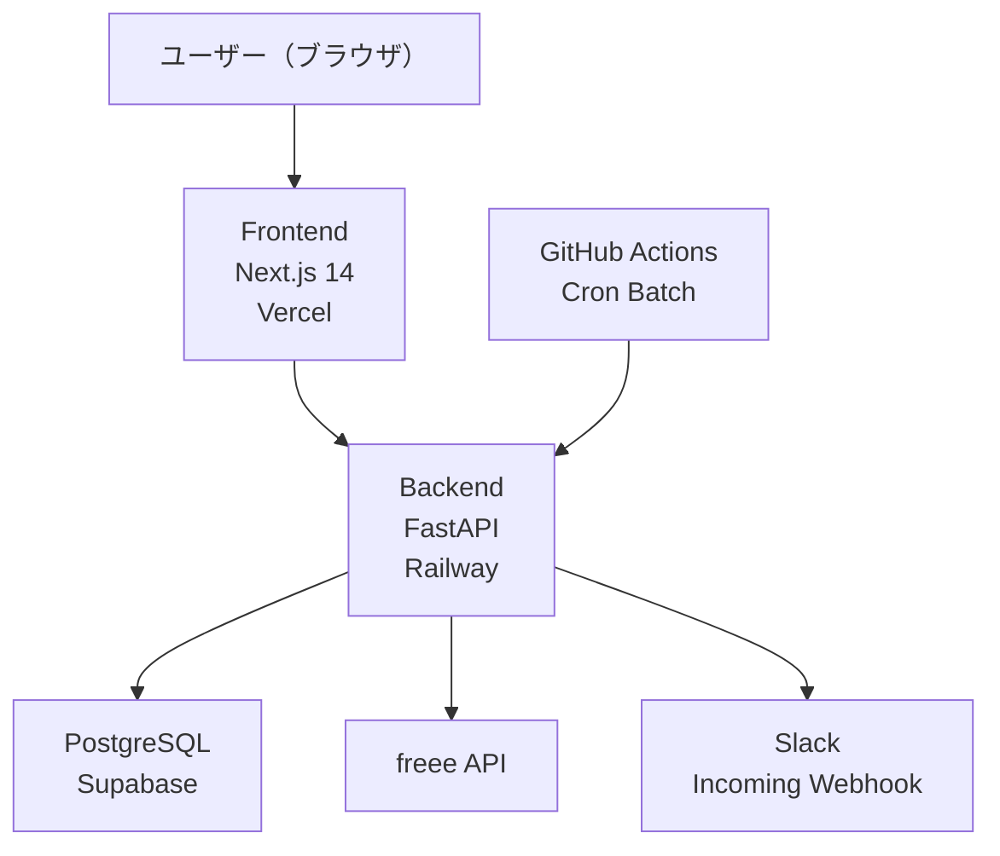

# invoice-manager

フリーランス向けの請求書管理アプリ。
freeeへの自動連携・Slackリマインド通知・交通費管理を一元化し、
毎月の請求業務にかかる手作業を削減する。

> 2026年5月から自分で継続使用中 ／ 累計17件処理

## デモ（画面イメージ）

### 請求書一覧


### freee連携画面


### Slack通知


## 技術構成



| 技術 | 選定理由 |
|---|---|
| Next.js 14 (App Router) | SSR・ルーティング・NextAuth.jsとの統合が容易 |
| FastAPI | 型安全・自動ドキュメント生成・Python資産の活用 |
| SQLAlchemy + Alembic | ORMとマイグレーション管理を分離して安全なスキーマ変更 |
| PostgreSQL (Supabase) | マネージドDB・無料枠で個人利用に十分 |
| Vercel + Railway | フロント・バックをそれぞれ最適なPaaSにデプロイ |
| NextAuth.js (Google OAuth) | 認証基盤を自前実装せず安全に委譲 |
| GitHub Actions | Cron バッチをインフラなしで定期実行 |

## ドメインモデル

### 主要な概念と関係

```
InvoiceTemplate ──生成──▶ Invoice ◀──反映── MonthlyTransportationSummary
                              │                        │
                              │               TransportationExpense
                              ▼
                        AccountTitle（freee勘定科目）
```

### 集約の境界

| 集約 | 境界を引いた理由 |
|---|---|
| Invoice | ステータスライフサイクルと整合性を単一集約で管理 |
| MonthlyTransportationSummary | 確定フラグ以降の不変性をまとめて保証するため |
| AccountTitle | freee側のマスタとの同期単位として独立 |
| InvoiceTemplate | 請求書生成のファクトリ入力として独立 |

### 業務ルールの配置

| ルール | 配置場所 | 理由 |
|---|---|---|
| ステータス遷移の可否 | ドメイン層（value_objects.py） | 不正遷移をDBに届ける前に防ぐ |
| 確定済み交通費の変更禁止 | ドメイン層（exceptions.py） | 集約ルートで一元管理 |
| 請求金額の正値バリデーション | ドメイン層（InvoiceAmount VO） | 値オブジェクトで型として表現 |
| 勘定科目の論理削除 | アプリ層（repository） | 参照整合性をアプリで制御 |
| freee連携の前提条件チェック | ドメインサービス（FreeeSyncDomainService） | 集約をまたぐ判定のため |

## 設計判断

### 判断1: ステータス遷移をドメイン層で管理
- **要件・制約**: 請求書は下書き→送付→リマインド→支払済み→freee連携→完了の順に遷移する
- **選択肢**: A. DBのCHECK制約 / B. アプリ層のif文 / C. ドメイン層のVALID_TRANSITIONSマップ
- **採用**: C。遷移ルールを1箇所に集約し、テスト・変更を容易にする
- **トレードオフ**: DBレベルの保護がないため、直接SQL操作には無防備

### 判断2: DRAFTステータスを廃止
- **要件・制約**: 作成後すぐに送付済み扱いにしたい・下書き管理は運用上不要
- **選択肢**: A. DRAFTを維持 / B. 作成時点でSENTに設定
- **採用**: B。不要なステータスを減らしてUIとフローをシンプルに保つ
- **トレードオフ**: 「下書きとして保存して後で送る」ユースケースに対応できない

### 判断3: freeeトークンをDBに保存
- **要件・制約**: Railwayはデプロイのたびにコンテナをリセットするためファイル保存が使えない
- **選択肢**: A. ファイル保存（backend/.tokens/） / B. DB保存 / C. 環境変数
- **採用**: B。デプロイをまたいで永続化でき、リフレッシュトークンの更新も一元管理できる
- **トレードオフ**: トークンがDBに平文保存される（暗号化未対応）

### 判断4: バッチ実行をGitHub Actionsに委譲
- **要件・制約**: 毎日定刻にfreee連携・Slackリマインドを実行したい
- **選択肢**: A. Railway Cron / B. GitHub Actions schedule / C. 外部Cronサービス
- **採用**: B。コードと同じリポジトリで管理でき・無料枠で十分・ログが見やすい
- **トレードオフ**: GitHub Actionsのスケジュール実行は数分の遅延が発生することがある

### 判断5: 交通費テンプレートを画面表示時に自動保存
- **要件・制約**: 毎月同じ曜日に同じ交通費が発生する・毎回手入力は煩雑
- **選択肢**: A. 手動で「テンプレートから生成」ボタンを押す / B. 画面表示時に自動保存
- **採用**: B。0件の月を開いた時点でDBに自動保存し、入力不要な状態にする
- **トレードオフ**: 意図せず自動保存される可能性があるが、編集・削除で対応可能

### 判断6: 認証をGoogle OAuth + NextAuth.jsに委譲
- **要件・制約**: 個人利用・セキュアな認証を自前実装コストなしで実現したい
- **選択肢**: A. メール/パスワード認証を自前実装 / B. Google OAuth + NextAuth.js
- **採用**: B。認証の複雑さをライブラリに委譲し、ドメインロジックに集中する
- **トレードオフ**: Googleアカウント依存になる・オフライン環境では使えない

### 判断7: 交通費の確定フラグを集約ルートで管理
- **要件・制約**: 確定後は交通費の追加・変更・削除を禁止したい
- **選択肢**: A. 各APIで確定チェックを個別実装 / B. 集約ルート（MonthlyTransportationSummary）で一元管理
- **採用**: B。確定チェックの漏れをアーキテクチャで防ぐ
- **トレードオフ**: 集約が大きくなるとパフォーマンスに影響する可能性がある

## 現時点の設計の限界

### マルチユーザー非対応
- **破綻する条件**: 複数人が同じアプリを使う場合、全員が同じ請求書・交通費を見てしまう
- **何を変えるか**: 各テーブルに `user_id` を追加してデータを分離する
- **今やっていない理由**: 個人利用のため不要（YAGNI）

### freeeトークンが1アカウントのみ
- **破綻する条件**: 複数のfreee事業所と連携したい場合
- **何を変えるか**: FreeeTokenテーブルに `company_id` を追加して複数管理
- **今やっていない理由**: 個人利用で事業所は1つのみ

### バッチのエラー通知がない
- **破綻する条件**: freee連携やリマインドが失敗しても気づけない
- **何を変えるか**: GitHub Actionsの失敗通知をSlack/メールに送る
- **今やっていない理由**: ログで確認できる範囲で運用コストを抑えている

### スケール時のN+1問題
- **破綻する条件**: 請求書が数百件を超えると一覧取得が遅くなる
- **何を変えるか**: eager loadingの見直し・ページネーションの導入
- **今やっていない理由**: 個人利用で件数が少なく現状問題なし

## セットアップ

### 必要な環境変数

backend は `backend/.env.example`、frontend は `frontend/.env.example` を参照。

### Backend

```bash
cd backend
python -m venv venv
source venv/bin/activate
pip install -r requirements.txt
alembic upgrade head
uvicorn main:app --reload --host 0.0.0.0
```

### Frontend

```bash
cd frontend
npm install
npm run dev
```

## セキュリティ

- 環境変数は絶対にコミットしないこと
- `backend/.env`・`frontend/.env.local` は `.gitignore` で除外済み
- 本番環境の秘密鍵は Railway・Vercel のダッシュボードで管理
- freeeトークンは DB に保存（`.gitignore` で除外済み）
