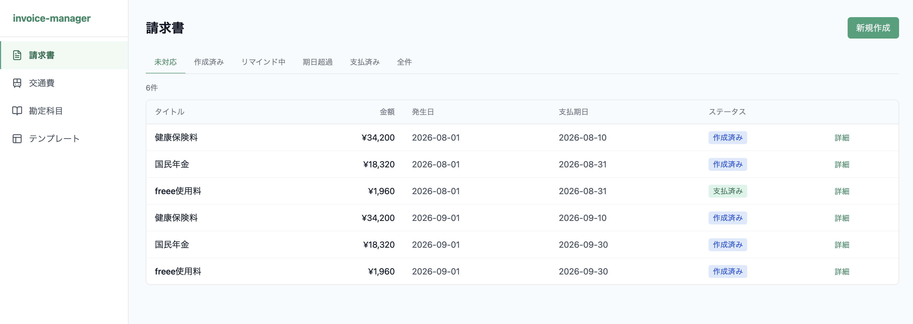
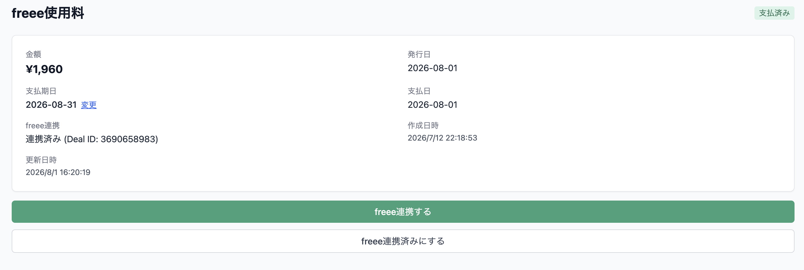
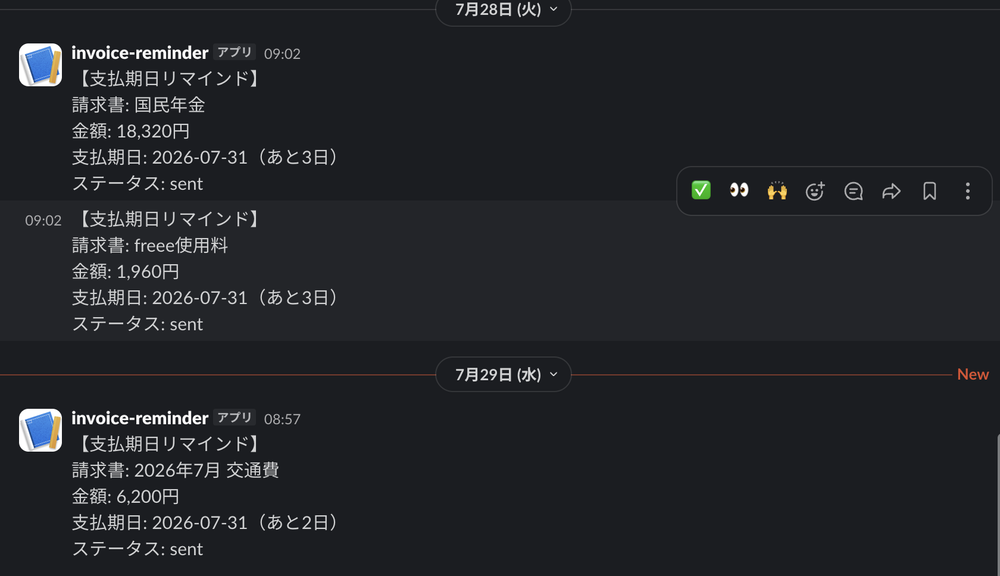
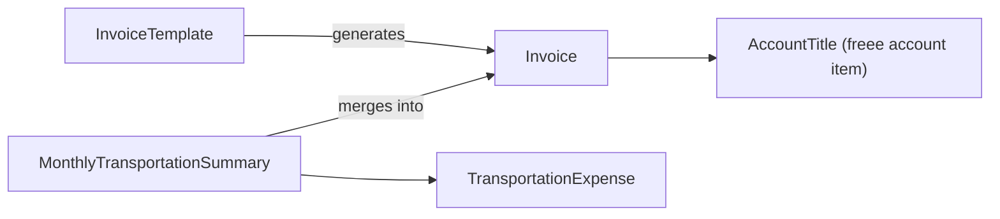

# invoice-manager

[](https://github.com/Ryosuke-Ha/invoice-manager/actions/workflows/backend-ci.yml)
[](https://github.com/Ryosuke-Ha/invoice-manager/actions/workflows/frontend-ci.yml)

A personal invoice management app for freelancers.
Automates the monthly billing workflow — freee sync, Slack payment reminders,
and transportation expense tracking — in one place.

> In use since May 2026 · 17 invoices processed

## Demo

No public demo: the app handles real financial data and freee credentials.

### Invoice List


### freee Integration


### Slack Notification


## Architecture


| Technology | Reason |
|---|---|
| Next.js 14 (App Router) | SSR, routing, and seamless NextAuth.js integration |
| FastAPI | Type-safe, auto-generated docs, Python ecosystem |
| SQLAlchemy + Alembic | Decoupled ORM and migration management for safe schema changes |
| PostgreSQL (Supabase) | Managed DB with a free tier sufficient for personal use |
| Vercel + Railway | Deploy frontend and backend on platforms optimized for each |
| NextAuth.js (Google OAuth) | Delegate auth complexity to a battle-tested library |
| GitHub Actions | Run cron batches on a schedule without additional infrastructure |

## Domain Model

### Key Concepts and Relationships



### Aggregate Boundaries

| Aggregate | Reason for boundary |
|---|---|
| Invoice | Owns the status lifecycle and enforces its own consistency |
| MonthlyTransportationSummary | Guarantees immutability after confirmation as a single unit |
| AccountTitle | Independent sync unit tied to freee master data |
| InvoiceTemplate | Isolated as factory input for invoice generation |

### Where Business Rules Live

| Rule | Layer | Reason |
|---|---|---|
| Status transition validation | Domain (value_objects.py) | Prevent invalid transitions before reaching the DB |
| Block changes on confirmed expenses | Domain (exceptions.py) | Enforced at the aggregate root |
| Invoice amount must be positive | Domain (InvoiceAmount VO) | Expressed as a type via Value Object |
| Soft-delete account titles | Application (repository) | Referential integrity controlled at app layer |
| freee sync eligibility check | Domain Service (FreeeSyncDomainService) | Cross-aggregate judgment |

## Design Decisions

### 1. Status transitions managed in the domain layer
- **Requirement**: Invoices follow a fixed lifecycle: created → reminding → paid → freee synced → done
- **Options**: A. DB CHECK constraint / B. if-statements in app layer / C. VALID_TRANSITIONS map in domain layer
- **Decision**: C — centralizes transition rules in one place, making them easy to test and modify
- **Trade-off**: No DB-level protection; direct SQL manipulation bypasses the rules

### 2. Removed the DRAFT status
- **Requirement**: Invoices should be treated as active immediately after creation; draft management added unnecessary complexity
- **Options**: A. Keep DRAFT / B. Set status to SENT on creation
- **Decision**: B — simplifies the UI and workflow by eliminating an unused state
- **Trade-off**: Cannot save an invoice as a draft for later; not needed for personal use

### 3. Storing freee OAuth tokens in the DB
- **Requirement**: Railway resets the container filesystem on every deploy, making file-based storage unreliable
- **Options**: A. File storage (backend/.tokens/) / B. DB storage / C. Environment variable
- **Decision**: B — persists across deploys and centralizes token refresh management
- **Trade-off**: Tokens stored in plaintext in the DB (encryption not implemented)

### 4. Delegating batch execution to GitHub Actions
- **Requirement**: Run freee sync and Slack reminders on a daily schedule
- **Options**: A. Railway Cron / B. GitHub Actions schedule / C. External cron service
- **Decision**: B — co-located with the codebase, free tier is sufficient, logs are accessible
- **Trade-off**: GitHub Actions scheduled jobs can be delayed by a few minutes

### 5. Auto-saving transportation expenses from templates on page load
- **Requirement**: The same transportation costs recur on the same weekdays every month; manual entry each time is tedious
- **Options**: A. Manual "Generate from template" button / B. Auto-save to DB on page load when month has zero records
- **Decision**: B — opens the page in a ready-to-confirm state with no manual input required
- **Trade-off**: Introduces a write side-effect on a read operation, which breaks GET idempotency. Accepted because the endpoint is single-user and the generated records are editable. Would move to an explicit action or a background job in a multi-user context.

### 6. Delegating authentication to Google OAuth + NextAuth.js
- **Requirement**: Secure authentication without the cost of building it from scratch
- **Options**: A. Custom email/password auth / B. Google OAuth + NextAuth.js
- **Decision**: B — offloads auth complexity to a well-maintained library
- **Trade-off**: Requires a Google account; unusable offline

### 7. Confirmation flag managed at the aggregate root
- **Requirement**: Once a monthly transportation summary is confirmed, no records should be added, modified, or deleted
- **Options**: A. Check confirmation status individually in each API handler / B. Enforce at aggregate root (MonthlyTransportationSummary)
- **Decision**: B — architectural enforcement prevents missed checks
- **Trade-off**: A large aggregate may impact performance at scale

### 8. Storing freee deal_id as String instead of Integer
- **Requirement**: freee's deal IDs exceeded the range of a 32-bit integer in production data
- **Options**: A. BigInteger column / B. String column
- **Decision**: B — avoids assumptions about freee's internal ID format and future ID growth; external system data characteristics should not constrain our type choices
- **Trade-off**: Loses numeric ordering guarantees; acceptable since deal IDs are used only as opaque foreign keys

### 9. Using Transaction Pooler (IPv4) for Supabase connection
- **Requirement**: Railway's outbound network does not support IPv6, but Supabase's direct connection and Session Pooler endpoints resolve to IPv6 addresses
- **Options**: A. Direct connection / B. Session Pooler / C. Transaction Pooler (port 6543)
- **Decision**: C — Transaction Pooler provides an IPv4-compatible endpoint and works within Railway's network constraints
- **Trade-off**: Transaction Pooler does not support prepared statements; SQLAlchemy must be configured with `prepared_statement_cache_size=0`

## Current Design Limitations

### No multi-user support
- **When it breaks**: If multiple people use the app, they share all invoices and expenses
- **What to change**: Add `user_id` to each table and filter by user
- **Why not now**: Personal use only (YAGNI)

### Single freee account only
- **When it breaks**: If connecting to multiple freee companies is needed
- **What to change**: Add `company_id` to the FreeeToken table
- **Why not now**: Only one company in personal use

### No error alerting for batch jobs
- **When it breaks**: freee sync or reminders fail silently
- **What to change**: Send GitHub Actions failure notifications to Slack or email
- **Why not now**: Logs are manually checkable; acceptable operational overhead for now

### N+1 risk at scale
- **When it breaks**: Invoice list queries will slow down beyond a few hundred records
- **What to change**: Review eager loading strategy; introduce pagination
- **Why not now**: Record count is low in personal use; not a current bottleneck

## Setup

### Environment Variables

See `backend/.env.example` and `frontend/.env.example` for required variables.

### Backend

```bash
cd backend
python -m venv venv
source venv/bin/activate
pip install -r requirements.txt
alembic upgrade head
uvicorn main:app --reload --host 0.0.0.0
```

### Frontend

```bash
cd frontend
npm install
npm run dev
```

## Security

- Never commit secrets — `.env` and `.env.local` are excluded via `.gitignore`
- Production secrets are managed in Railway and Vercel dashboards
- freee OAuth tokens are stored in the DB (not in files)
- Security headers (X-Frame-Options, CSP, HSTS, etc.) configured in `next.config.js`
- Rate limiting on batch endpoints via `slowapi`
